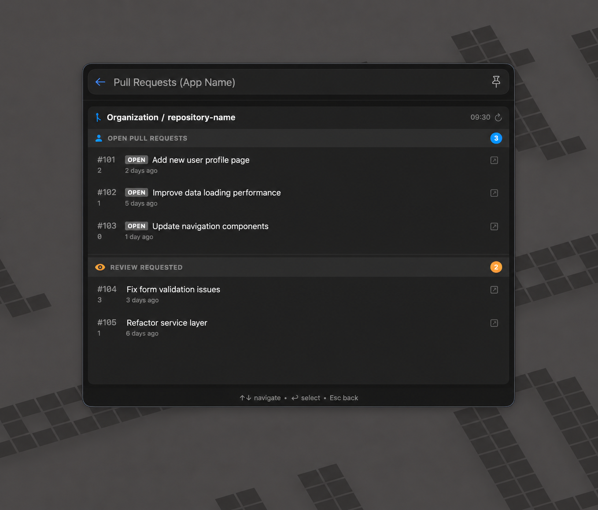

# GitHub PR Monitor

Lists open pull requests and review requests for a configured GitHub repository.

## Origin

- Original repository: [jhasubhash/btt-plugins](https://github.com/jhasubhash/btt-plugins)
- Original source: [GitHubPRMonitor.swift](https://github.com/jhasubhash/btt-plugins/blob/main/GitHubPRMonitor.swift)
- Imported from commit: `c8a095204b44e3fe8c5bb0e0455b24744453f916`
- Copyright: Copyright (c) Subhash Jha and contributors to jhasubhash/btt-plugins.
- Upstream license: No explicit upstream license file was present in the upstream repository at import time.

## Install

Drop [GitHubPRMonitor.swift](GitHubPRMonitor.swift) onto the BetterTouchTool preferences window, or copy it into:

```text
~/Library/Application Support/BetterTouchTool/Plugins/
```

## Screenshots



## Safety Notes

Declared permissions: `shell`, `network`, `open-url`, `user-defaults`

- Runs the local `gh` CLI and uses its existing GitHub authentication.
- Stores the configured repository in UserDefaults.
- Opens selected pull requests in the browser.
