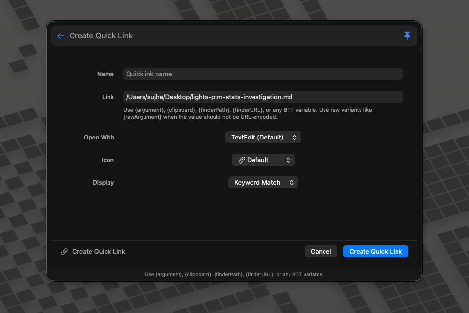

# Quick Links

Save reusable URL or filesystem-path templates and open them with the right app.

## Origin

- Original repository: [jhasubhash/btt-plugins](https://github.com/jhasubhash/btt-plugins)
- Original source: [QuickLinkLauncherPlugin.swift](https://github.com/jhasubhash/btt-plugins/blob/main/QuickLinkLauncherPlugin.swift)
- Imported from commit: `c8a095204b44e3fe8c5bb0e0455b24744453f916`
- Copyright: Copyright (c) Subhash Jha and contributors to jhasubhash/btt-plugins.
- Upstream license: No explicit upstream license file was present in the upstream repository at import time.

## Install

Drop [QuickLinkLauncherPlugin.swift](QuickLinkLauncherPlugin.swift) onto the BetterTouchTool preferences window, or copy it into:

```text
~/Library/Application Support/BetterTouchTool/Plugins/
```

## Screenshots



## Safety Notes

Declared permissions: `clipboard-read`, `clipboard-write`, `open-url`, `file-read`, `launcher-plugin-instances`, `user-defaults`

- Reads the clipboard to suggest URL/path templates and can copy resolved links back to the clipboard.
- Uses BTT launcher plugin instances to save quick links.
- Opens URLs, files, and folders with the selected or default application.
