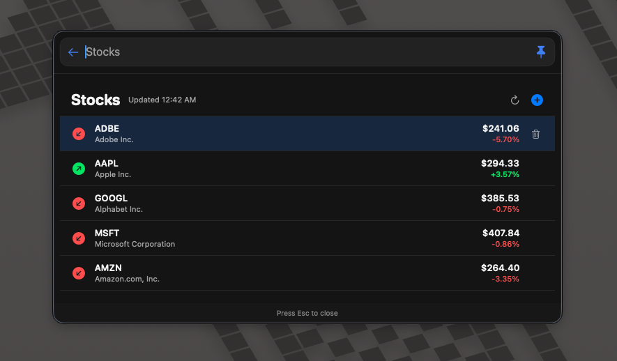

# Stock Prices

Look up stock quotes and manage a watchlist with sparkline details.

## Origin

- Original repository: [jhasubhash/btt-plugins](https://github.com/jhasubhash/btt-plugins)
- Original source: [StockPrices.swift](https://github.com/jhasubhash/btt-plugins/blob/main/StockPrices.swift)
- Imported from commit: `c8a095204b44e3fe8c5bb0e0455b24744453f916`
- Copyright: Copyright (c) Subhash Jha and contributors to jhasubhash/btt-plugins.
- Upstream license: No explicit upstream license file was present in the upstream repository at import time.

## Install

Drop [StockPrices.swift](StockPrices.swift) onto the BetterTouchTool preferences window, or copy it into:

```text
~/Library/Application Support/BetterTouchTool/Plugins/
```

## Screenshots




## Safety Notes

Declared permissions: `network`, `user-defaults`

- Fetches quote and historical price data from Yahoo Finance endpoints.
- Stores the watchlist, quote snapshots, and surface size in UserDefaults.
- Does not trade or modify accounts; it is display-only.
