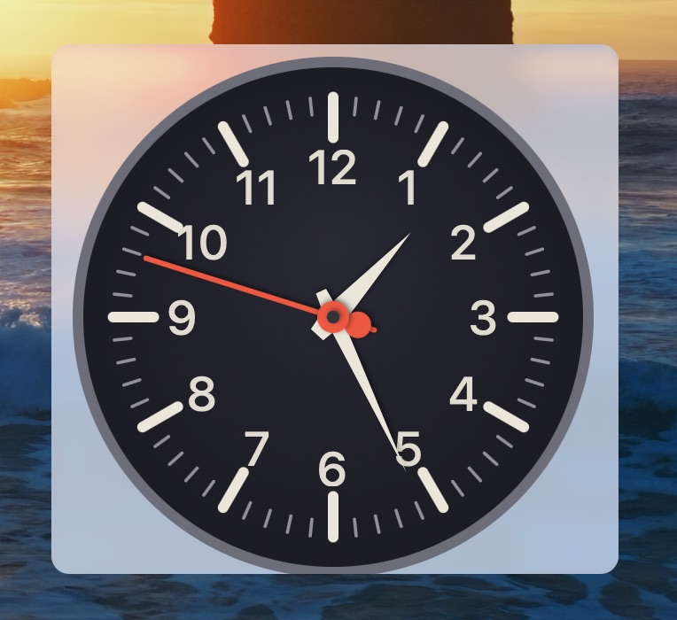

# Analog Clock

Floating menu widget example that draws a smooth analog clock with hour, minute,
and second hands.

## Installation

Drop `AnalogClock.swift` onto the BetterTouchTool preferences window.

## Safety Notes

This plugin is self-contained and does not access files, the network, the
clipboard, or shell commands.
