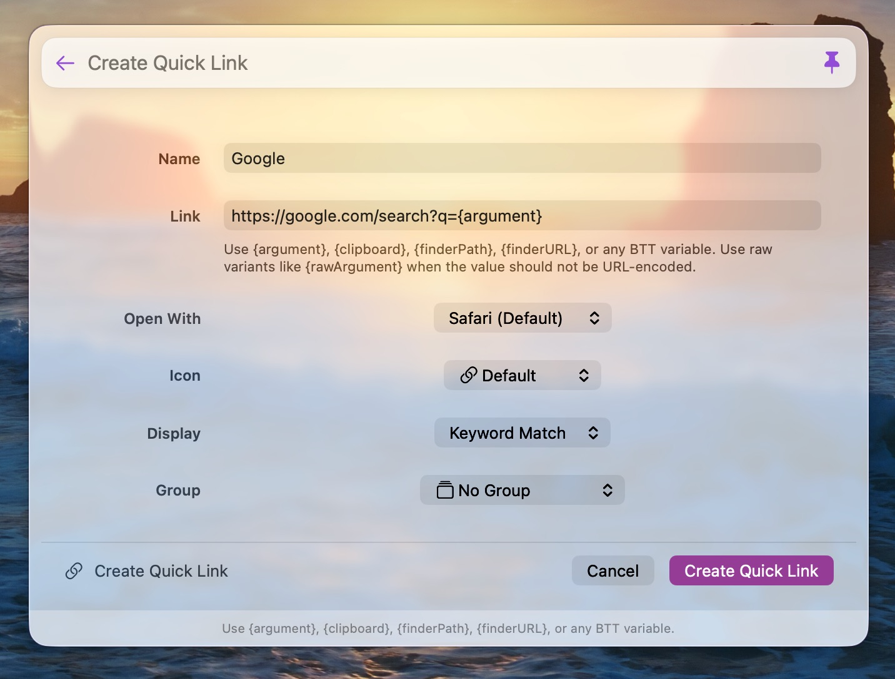

# Quick Links

Creates saved launcher items that open reusable URL templates. This example is
useful for plugins that need user-created instances, editing surfaces, custom
commands, variable replacement, and browser launching.

Install by dropping `QuickLinkLauncherPlugin.swift` onto the BetterTouchTool
preferences window.
