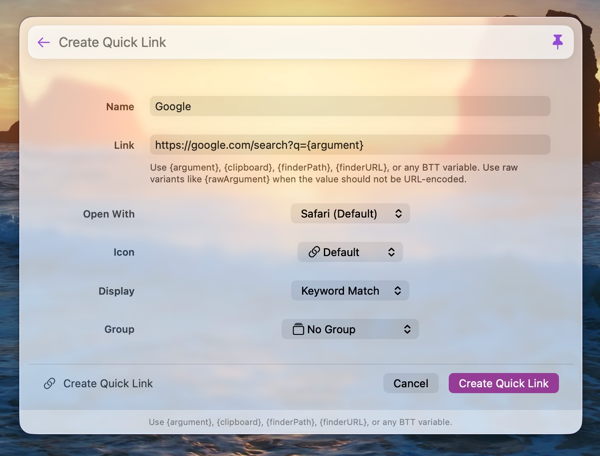

# Quick Links

Creates saved launcher items that open reusable URL templates. This example is
useful for plugins that need user-created instances, editing surfaces, custom
commands, variable replacement, and browser launching.

Install by dropping `QuickLinkLauncherPlugin.swift` onto the BetterTouchTool
preferences window.

`{argument}` contains the input after the link's matching launcher keyword or
search term. Custom keywords use the active launcher's settings, including any
launcher-specific override. The longest leading match wins: a keyword `g` turns
`g cats` into `cats`, `google images cats` uses the full `google images` keyword,
and a symbol keyword such as `>` also accepts `>cats`. An exact keyword without
additional input produces an empty argument. Input without a matching keyword
is kept in full.

`{query}` always contains the full input. Use `{rawArgument}` or `{rawQuery}` when
the value should not be URL-encoded. With an empty launcher input, opening or
copying a link uses the clipboard as the argument; previews leave the argument
placeholder visible.

The same host query parser supplies arguments for previews, opening, and copying
URLs. Older BTT versions without that API retain built-in search-term parsing;
custom launcher keyword removal requires a host that supports
`launcherQueryInput(pluginIdentifier:itemIdentifier:query:keywords:launcherID:)`.
